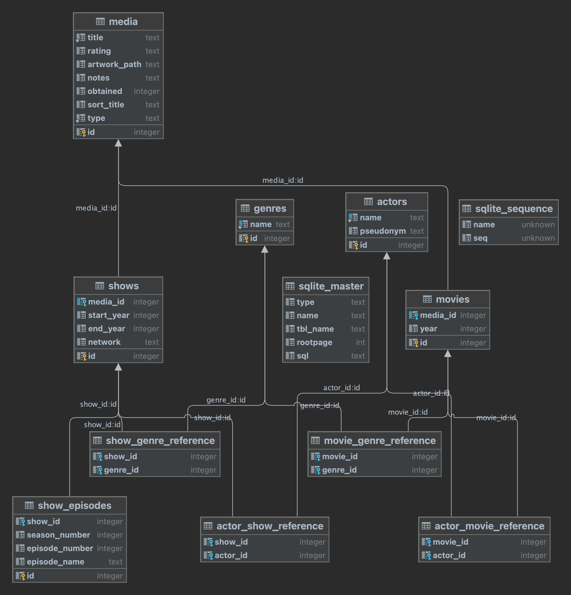

# MediaDB

### Overengineered media information keeper

    Using jinja templates, sqlite and FastAPI to serve tables from a locally hosted web app on my home ubuntu server.

    Currently built to pull data from some CSVs I constructed by pulling view history from netflix and adding more info/items to it.

    We then clean it up and create some relations like actors and genres.

    This is a natural evolution of an OCD burdened brain, from creating unnecessary CSV and Excel sheets for lists of things, to holding them in a database and serving via web apps for added potential functionality.

    In the future maybe add support to stream to smart TV and other devices on the network by pointing some protocol to a file location.

    At some point will also add optional support for a PSQL docker container since sqlite doesn't come with much functionality. Since it's hosted on an ubuntu server full of docker containers anyway, could be a neater approach and most importantly much more unnecessary.

### Model (So Far):

